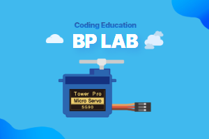

# Servo 360 Extension for MakeCode



This extension allows you to control a 360-degree continuous rotation servo motor with the micro:bit.

This extension is an enhanced version of the code originally developed under the MIT License by [tinkertanker/pxt-continuous-servo](https://github.com/tinkertanker/pxt-continuous-servo.git).

We sincerely appreciate the efforts of the original developers who created the foundation for this extension.

## 🚀 Features

- Easy control of 360-degree continuous rotation servo motors
- Support for both full-speed and variable-speed rotation
- Simple blocks for motor control in both directions
- Ability to turn off motor to save power
- Can be registered as a MakeCode extension for easy use
- Support for Korean

## Blocks

### 1. Spin One Way Block

- 🔹 Description

  - Spins the servo motor in one direction at full speed
  - Default pin is P1

- ✅ Usage example

  ```blocks
  bplab.servo360.spinOneWay(servo360.ServoPin.P1)
  ```

### 2. Spin Other Way Block

- 🔹 Description

  - Spins the servo motor in the opposite direction at full speed
  - Default pin is P1

- ✅ Usage example

  ```blocks
  bplab.servo360.spinOtherWay(servo360.ServoPin.P1)
  ```

### 3. Spin One Way With Speed Block

- 🔹 Description

  - Spins the motor in one direction with variable speed
  - Speed range: 0 to 100
  - Default pin is P1, default speed is 50

- ✅ Usage example

  ```blocks
  bplab.servo360.spinOneWayWithSpeed(servo360.ServoPin.P1, 75)
  ```

### 4. Spin Other Way With Speed Block

- 🔹 Description

  - Spins the motor in the opposite direction with variable speed
  - Speed range: 0 to 100
  - Default pin is P1, default speed is 50

- ✅ Usage example

  ```blocks
  bplab.servo360.spinOtherWayWithSpeed(servo360.ServoPin.P1, 25)
  ```

### 5. Turn Off Motor Block

- 🔹 Description

  - Turns off the motor at the specified pin
  - Default pin is P1

- ✅ Usage example

  ```blocks
  bplab.servo360.turnOffMotor(servo360.ServoPin.P1)
  ```

## 📜 License

MIT License

## 💡 About BPLab

BPLab is a specialized company that provides coding education that anyone can easily learn. We provide in-person and online coding education for children, teens, adults, institutions, organizations, small groups, and schools in Korea in various fields such as IoT, artificial intelligence, micro:bit and Arduino.

We are also leading the way in developing and distributing coding education kits that allow learners to build, program, and experience the principles of coding. These kits utilize microcontrollers such as Arduino and micro:bit, as well as various sensors. This micro:bit extension is available for use in courses taught by BPLab.

Visit our websites:

- Korea: [https://bplab.kr](https://bplab.kr)
- Global: [https://bplab-us.com](https://bplab-us.com)
- Japan: [https://bplab-jp.com](https://bplab-jp.com)

## 📍 Supported targets

- for PXT/microbit

<script src="https://makecode.com/gh-pages-embed.js"></script><script>makeCodeRender("{{ site.makecode.home_url }}", "{{ site.github.owner_name }}/{{ site.github.repository_name }}");</script>
