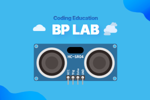

> [👈 Back](../README.md)

# Ultrasonic Extension for MakeCode



This extension allows you to measure distances using an ultrasonic sensor with the micro:bit.

This extension is an enhanced version of the code originally developed under the MIT License by [microsoft/pxt-sonar](https://github.com/microsoft/pxt-sonar.git).

We sincerely appreciate the efforts of the original developers who created the foundation for this extension.

## 🚀 Features

- Easy distance measurement using ultrasonic sensors
- Support for multiple measurement units (microseconds, centimeters, inches)
- Configurable maximum distance measurement
- Simple block interface for easy integration
- Can be registered as a MakeCode extension for easy use
- Support for Korean

## Blocks

### 1. Ping Measurement Block #ultrasonic-ping

- 🔹 Description

  - Measures the distance to an object using an ultrasonic sensor
  - Supports different measurement units:
    - Microseconds (μs)
    - Centimeters (cm)
    - Inches (inches)

- 🔹 Parameters

  - `trig`: Trigger pin for the ultrasonic sensor
  - `echo`: Echo pin for the ultrasonic sensor
  - `unit`: Measurement unit (μs, cm, or inches)

- ✅ Usage example

  ```blocks
  let ms = bplab.ultrasonic.ping(DigitalPin.P14, DigitalPin.P15, bplab.ultrasonic.PingUnit.MicroSeconds)
  let cm = bplab.ultrasonic.ping(DigitalPin.P14, DigitalPin.P15, bplab.ultrasonic.PingUnit.Centimeters)
  let inches = bplab.ultrasonic.ping(DigitalPin.P14, DigitalPin.P15, bplab.ultrasonic.PingUnit.Inches)

  basic.showNumber(ms)
  basic.showNumber(cm)
  basic.showNumber(inches)
  ```

## 🔧 How it works

The ultrasonic sensor sends out a pulse and measures the time it takes for the echo to return:

1. Trigger pin sends a 10μs pulse
2. Echo pin measures the return time
3. Distance is calculated based on the selected unit:
   - Centimeters = echo time / 58
   - Inches = echo time / 148
   - Microseconds = raw echo time

## 📜 License

MIT License

## 💡 About BPLab

BPLab is a specialized company that provides coding education that anyone can easily learn. We provide in-person and online coding education for children, teens, adults, institutions, organizations, small groups, and schools in Korea in various fields such as IoT, artificial intelligence, micro:bit and Arduino.

We are also leading the way in developing and distributing coding education kits that allow learners to build, program, and experience the principles of coding. These kits utilize microcontrollers such as Arduino and micro:bit, as well as various sensors. This micro:bit extension is available for use in courses taught by BPLab.

Visit our websites:

- Korea: [https://bplab.kr](https://bplab.kr)
- Global: [https://bplab-us.com](https://bplab-us.com)
- Japan: [https://bplab-jp.com](https://bplab-jp.com)

## 📍 Supported targets

- for PXT/microbit

<script src="https://makecode.com/gh-pages-embed.js"></script><script>makeCodeRender("{{ site.makecode.home_url }}", "{{ site.github.owner_name }}/{{ site.github.repository_name }}");</script>
